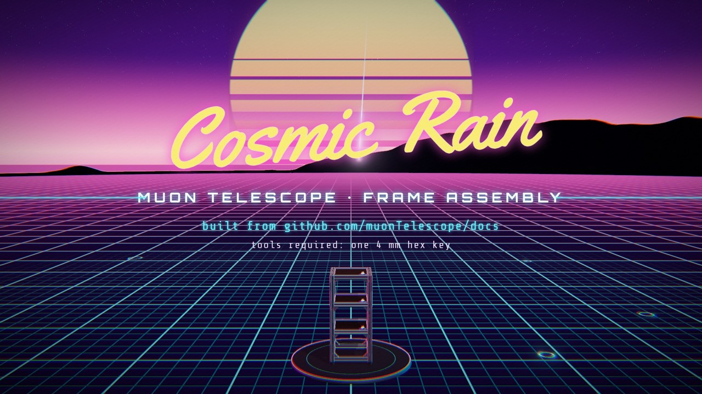

# Cosmic Rain — a Muon Telescope frame assembly music video

An animated, synthwave-style **assembly music video** for the muon telescope frame documented in
[muonTelescope/docs](https://github.com/muonTelescope/docs). Everything in it (the 3D models,
the animation, the music, and the robot vocals that sing the build steps) is generated
from code in this repository. No stock footage, samples or recorded audio are used.

**▶ [`dist/cosmic-rain.mp4`](dist/cosmic-rain.mp4)**: 1920×1080, 30 fps, 2:35, H.264 + AAC



## What you're watching

The video follows the frame chapter of the docs (`tex/frame/frame.tex` and the Illustrator
assembly sheets `frameAssembly.pdf`) step by step, on the beat:

| Bars | Section | On screen (from the docs) |
|---|---|---|
| 0–7 | Intro | Cosmic-ray muons rain out of a starry sky; title card over a ghost wireframe of the finished frame |
| 8–15 | Bill of materials | One part per bar: 4× 396 mm 2020 posts, 16× 150 mm beams, 64× HBLFSNF5 angle brackets, 156× HNKK5-5 T-nuts, 128× M5×10, 4× M5×25, 4× rubber bumpers, 1× 4 mm hex key |
| 16–23 | Steps 1–2 | 4 T-nuts slide into a (see-through) 150 mm beam; 2 brackets drop on and the brass hex key drives the M5×10 screws; the sub-assembly is cloned ×16 |
| 24–31 | Step 3 | Four posts slam down; 8 T-nuts twist into the post slots; the bottom ring's beams fly in; 8 screws drive home |
| 32–39 | Steps 4–6 (chorus) | Rings two, three and four assemble in 2 bars each while the camera orbits; "frame complete" glow sweep |
| 40–47 | Step 7 | The frame flips upside-down, rubber bumpers + M5×25 screws go on, it flips back and lands on its feet; a blue threadlocker wave washes over every screw |
| 48–55 | Detector (bridge) | Three scintillator paddles drop through the rings, SiPM (MPPC) boards snap on, lights go down… one slow-motion muon lights all three paddles: *coincidence!* |
| 56–63 | Final chorus | Muon rain with live triple-coincidence counter and a 3-channel scope |
| 64–72 | Outro | Credits and end title |

Every snap, T-nut clink, hex-key ratchet, whoosh and muon "zap" in the soundtrack is placed from the
same choreography data that drives the animation, so sound and picture are frame-locked. The song
runs at 112.5 BPM, which is exactly 16 video frames per beat.

## Lyrics (sung by a vocoded robot)

> *Cosmic rain is falling down / Build a frame to catch it now*
> Four tall posts · Sixteen short · Sixty-four brackets · T-nuts: one fifty-six ·
> One twenty-eight screws · Four long screws · Four rubber feet · And one hex key!
> Slide the T-nuts in the slot / Bracket, screw, and turn the key /
> Do it sixteen times, don't stop / Sixteen beams with wings on top
> Stand four pillars in a square / Eight nuts, eight screws, lock the base /
> Bottom ring is bolted there / Now we're building up to space!
> **Stack it, square it, bolt it tight / Four millimeter, turn it right /
> Ring by ring we build it high / Catch the rain from the cosmic sky**
> Flip it over, upside down / Twenty-five mil, screw it in /
> Rubber feet to hold the ground / Dab of blue to lock it in
> Three black paddles, plastic glow / Drop them through the rings below /
> Silicon eyes wait in the dark / One muon, three sparks!
> **Stack it, square it, bolt it tight / Four millimeter, turn it right /
> Three flashes at the speed of light / Catch the rain from the cosmic sky**
> Cosmic rain is falling down / Now we catch it, safe and sound

## How it's made

```
song.json ──────────────┬──────────────────────────────┐
 (tempo, chords,        │                              │
  lyrics + melody)      ▼                              ▼
video/choreo.js ──► tools/export-cues.mjs ──► audio/compose.py ──► build/audio.wav
 (every part's         (sound-effect cue list)    (synth + vocoder)    build/timeline.json
  keyframes, camera,                                                   (kick/snare times)
  muon events)                                                               │
      │                                                                      ▼
      └──────────► video/scene.js + hud.js (three.js) ──► render.mjs ──► dist/cosmic-rain.mp4
                    rendered frame-by-frame in headless Chromium, muxed with ffmpeg
```

- **`video/models.js`**: procedural parts. It builds a real 2020 T-slot profile (slots, undercuts,
  centre bore) extruded to 396 mm and 150 mm, the cast angle bracket, M5 socket-head cap screws with
  lathed threads and a hex socket, T-nuts, rubber bumpers, the 4 mm hex key, scintillator paddles
  with a chamfered corner, and SiPM boards.
- **`video/choreo.js`**: the assembly logic. It places every beam, bracket, nut and screw from the
  frame dimensions (posts at ±85 mm, rings every 125⅓ mm, brackets on top of the bottom ring and
  underneath the others, as in the docs' step 9 render), and quantizes all motion to the beat.
- **`video/scene.js`**: the outrun look: neon grid floor, striped retro sun, mountain ridge,
  a neon-lit PMREM reflection environment for the metal, bloom, and a retro pass (chromatic
  aberration, scanlines, grain, vignette).
- **`video/hud.js`**: step badges, BOM list, ×16 counter, karaoke lyrics, coincidence counter and scope.
- **`audio/compose.py`**: numpy/scipy/numba synthesis of an 808-style kick, a gated-reverb snare,
  hats, toms and risers; octave bass, supersaw pads, arpeggios and a saw lead; Freeverb and ping-pong
  delay; kick side-chain; and a mastering chain. Vocals come from **espeak-ng** speaking each word.
  The speech is split into 40 bands, stretched so the vowels fill each note, and re-synthesized on
  the melody's pitch with a harmony a third below in the choruses.
- **`tools/asr_check.py`**: an objective intelligibility check for the robot vocals. The pocketsphinx
  recognizer is asked which lyric line each sung phrase is. The vocoder settings were tuned with
  it: the final vocals are identified correctly 53% of the time, versus 44% for plain espeak speech.

## Rebuild it

Requirements: Node 18+, Python 3.10+, `espeak-ng`, `ffmpeg`, and a Chromium build
(`CHROME=/path/to/chrome`; defaults to the Playwright Chromium at `/opt/pw-browsers`).

```bash
npm install
pip install numpy scipy numba            # + pocketsphinx for tools/asr_check.py
npm run cues                             # choreography -> build/cues.json
npm run audio                            # -> build/audio.wav, build/timeline.json
npm run stills -- 64,130,219.6           # optional: preview frames at given beats -> build/stills/
npm run video                            # -> dist/cosmic-rain.mp4  (~1 h on 4 CPU cores, software WebGL)
```

To preview in a browser in real time, serve the repo root with any static server and open
`video/index.html?play` (it plays `build/audio.wav` in sync).

## Credits

Frame design, bill of materials, part numbers and assembly steps:
[muonTelescope/docs](https://github.com/muonTelescope/docs) (Sawaiz Syed).
Fonts: Orbitron, Yellowtail and Share Tech Mono via Fontsource (SIL OFL).
